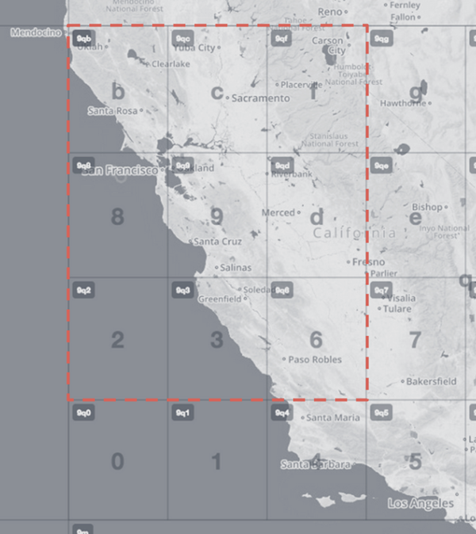

The Onestop ID is an attempt to link transit data across disparate sources. At present, each transit operator, each government department, and each software developer has their own scheme for identifying and labeling their data. Take, for example, the San Francisco Municipal Transportation Agency:

* It's known colloquially as: `MUNI`.
* It's known in its [GTFS](https://en.wikipedia.org/wiki/General_Transit_Feed_Specification) feed as `SFMTA`.
* It's known in the [US National Transit Database](http://www.ntdprogram.gov) as `#9015`.
* It's known on the [GTFS Data Exchange](http://www.gtfs-data-exchange.com/) as `san-francisco-municipal-transportation-agency`

When considering just this one operator of transit service, the differences are minor. But the US National Transit Database includes 769 different operators. Building software to handle data from that many different operators, each with a few different IDs, is more of a challenge. And we're still only talking about the U.S.

Just as each transit operator has multiple IDs, each bus stop and train station has at least one ID for each of the operators that serves it. Take, for example, New York's Penn Station:

* It's known to the [International Air Transport Association](https://en.wikipedia.org/wiki/International_Air_Transport_Association_airport_code) as `ZYP`.
* It's known in Amtrak's GTFS feed as `NYP`.
* It's known in the Long Island Railroad's GTFS feed as `Stop #8`.
* It's known in New Jersey Transit's GTFS feed as `Stop #105`.

In the [Transitland Feed Registry](/documentation/feed-registry/), we've created listings for the San Francisco Municipal Transportation Agency. For the SFMTA, we've assigned the transit agency a Onestop ID of `o-9q8y-sfmta` and its feed a Onestop ID of `f-9q8y-sfmta`. We also use these Onestop IDs in our [Transitland Datastore](/documentation/datastore/) service. You can query it for:

- the SFMTA feed: [`https://transit.land/api/v1/onestop_id/f-9q8y-sfmta`](https://transit.land/api/v1/onestop_id/f-9q8y-sfmta)
- the SFMTA operator record: [`https://transit.land/api/v1/onestop_id/o-9q8y-sfmta`](https://transit.land/api/v1/onestop_id/o-9q8y-sfmta)
- stops served by the SFMTA: [`https://transit.land/api/v1/stops?served_by=o-9q8y-sfmta`](https://transit.land/api/v1/stops?served_by=o-9q8y-sfmta)
- routes operated by the SFMTA:
[`https://transit.land/api/v1/routes?operated_by=o-9q8y-sfmta`](https://transit.land/api/v1/routes?operated_by=o-9q8y-sfmta)

Notice how stops and routes are assigned their own Onestop IDs as well.

## What is in a Onestop ID?

A Onestop ID is an alphanumeric, global, immutable identifer for transit feeds, operators/agencies, stops/stations, and routes provided by authoritative sources that contain timetable and geographic information for transit networks. Every Onestop ID includes three components, separated by hyphens. For example:

1. An entity type

    - `f` for feeds
    - `o` for operators/agencies
    - `s` for stops/stations
    - `r` for routes

2. A [geohash](/news/2015/06/05/geohashes-and-you.html), a set of characters that can be translated into a geographic bounding box around the service area of the operator/agency, the location of the stop/station, or the coverage of a route. The more characters, the more precise and smaller the bounding box. For example, the geohash `9q8zn2j` refers this purple rectangle in San Francisco:

3. An abbreviated name that is short but understandable. The only punctuation that is allowed are tildes (`~`) to indicate word breaks. The name doesn't have to be unique across the whole world, but it must be unique within the bounding box of the particular geohash.

Want to browse geohashes for your location? Here's a map of geohashes over the entire globe: [mapzen/leaflet-spatial-prefix-tree](http://mapzen.github.io/leaflet-spatial-prefix-tree/)

Sometimes, an operator's service area won't fit exactly inside a geohash's bounding box. The most extreme example is London, where the tube network crosses the prime meridian. No one geohash can be used to effectively identify the extent of Transport for London's service area.

Therefore, the geohash in a Onestop ID is used to refer to a focal point. In the case of feeds and operators, their coverage/service area can extend out to any of the eight neighboring geohash bounding boxes. In the case of routes, they can extend into any of the eight neighbors. The centroid of the feed, operator, or route will always be located in the geohash that's included in the Onestop ID&mdash;the focal point, that is&mdash;but the lines or polygons could extend out into neighbors.

For example, here is the geohash `9q9` and its eight neighbors. This geohash can refer to Bay Area Rapid Transit (BART), including all its service area.

Onestop IDs are case insensitive. It is recommended to use lower case internally in your systems. When displaying IDs for users, you can capitalize for readability.

Onestop IDs should be no longer than 64 characters.

## Where is the authority for a Onestop ID

Onestop IDs are currently generated in the [Transitland Datastore web service](/documentation/datastore/) hosted at `https://transit.land/api/v1`

To browse Onestop IDs for feeds and operators, try the [Transitland Feed Registry](/documentation/feed-registry/).

To browse Onestop IDs for operators, stops, and routes, try the [Transitland Playground](/documentation/playground/).

Onestop IDs are also included on all of the [Datastore's API endpoints](/documentation/datastore/api-endpoints.html).

For the future, Transitland may consider distributed mechanisms for registering, updating, and removing Onestop IDs, and welcomes suggestions on how to best share this responsibility among systems and users.
